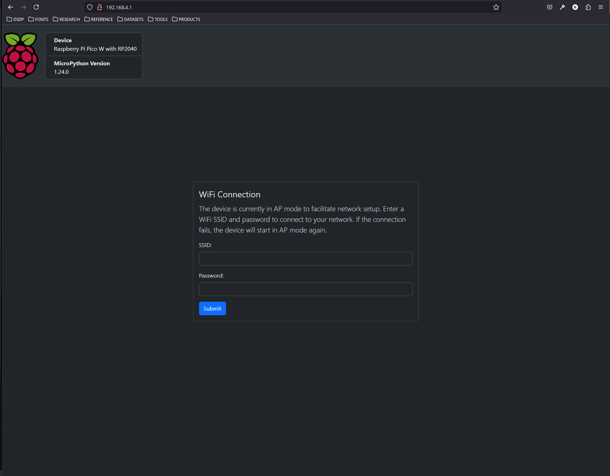

# Micropython Default

> [!NOTE]  
> This project is a WIP.

## Introduction

This MicroPython project acts as a template, which forms the basis for creating a Pico W 'thing' in an AWS IoT Core context. It also acts as a template for Micropython projects that need to facilitate access to WiFi through serving a credentials form. The default `main.py` runs an async application function (`async_main`), which carries out the following steps:

1. Attempt WiFi STA connection using env/secrets
2. Synchronise network time on STA connection
3. Monitor for connection issues
4. Wait 15 seconds and check connection again
5. Start Microdot server on WiFi connection fail
    1. Serve HTML form to update WiFi credentials
    2. Update env/secrets if correct
    3. Shutdown server & attempt WiFi connection
    4. Synchronise network time on STA connection
6. Repeat steps 3 - 5 as necessary

Modification of `async_main` should allow extra functionality, such as connection to an AWS IoT Core endpoint via the MicroPython MQTT libraries and the provided template functions in `lib/project/connection.py`.

This project has the following dependency tree:

```text
micropython-default
├── picoproject                       <-- MicroPython project CLI
├── bump-my-version (group: dev)
├── micropython-rp2-rpi-pico-w-stubs  <-- MicroPython Pico W stubs
├── ruff (group: dev)                 <-- Linting/formatting
├── sphinx (group: dev)               <-- Documentation
└── sphinx-rtd-theme (group: dev)     <-- Read the docs theme
```

I am testing the use of another library, picoproject, which is a CLI (README[repository](https://github.com/andyrids/picoproject)) for managing local installation of MicroPython packages for development, MicroPython binary compilation and exporting of project files.

## Project Layout

```text
src/micropython_default
├── env
│   └── secrets.py                  <-- WiFi credentials for STA/AP mode
├── lib
│   ├── microdot                    <-- microdot library
│   │   ├── __init__.py
│   │   └── microdot.py
│   ├── project                     <-- project custom modules
│   │   ├── connection.py
│   │   ├── telemetry.py
│   │   └── utility.py
│   └── umqtt                       <-- MicroPython umqtt library
│       ├── robust.py
│       └── simple.py
└── server                          <-- microdot server files
    ├── assets
    │   ├── bootstrap.min.css.gz
    │   └── favicon.ico.gz
    └── index.html
```

`micropython-default/src/micropython_default` is the main project directory.

The `env/secrets.py` is used to store credentials to connect to a WiFi network and to connect to the Pico, when in AP mode. The default secrets file contents are shown below:

```python
AP_SSID = None
AP_PASSWORD = None
WLAN_SSID = None
WLAN_PASSWORD = None
```

Example updated secrets:

```python
AP_SSID = None
AP_PASSWORD = None
WLAN_SSID = "MY_WIFI_SSID"
WLAN_PASSWORD = "MY_WIFI_PASSWORD"
```

These values are dynamically imported/set using `dynamic_get_secret` and `dynamic_set_secret` in the `lib/project/utility.py` module. This functions facilitate secret variable imports like a python module, even after a secret value change.

The `lib` directory is used to host MicroPython packages locally to aid in development. This template uses the umqtt MicroPython library and the microdot framework, which is compatible with MicroPython. The `lib/project` directory is meant to store custom modules for your project.

The `server` directory holds assets and an `index.html` file, which creates a form served by the microdot server. This form is styled using bootstrap, in offline mode. Bootstrap is too big normally, but we demonstrate the realms of the possible using microdot to serve gzip-compressed bootstrap assets - useful for those wanting to know how to achieve this with such minimal resources on a microcontroller.

> [!TIP]  
> Detailed docstrings are included at the module and function/class level for this project.

## Installation

**uv** is used as the Python package manager. To install **uv** see the installation
guide @ [uv documentation](https://docs.astral.sh/uv/getting-started/installation/).

The following command will sync the project dependencies and create a virtual environment:

```bash
cd <project directory>
uv sync
```

Activate the virtual environment created by uv with the following command:

```bash
source .venv/bin/activate
```

## Build & distribute the template

> [!WARNING]  
> Make sure your Pico W device is connected and your virtual environment is activated.

Check your Pico's current filesystem with the following mpremote command:

```bash
(micropython-default) mpremote fs ls
```

Output of `ls :` will indicate an empty system. The following command will clear the Pico filesystem (use caution):

```bash
(micropython-default) mpremote exec --no-follow "import os, machine, rp2; os.umount('/'); bdev = rp2.Flash(); os.VfsLfs2.mkfs(bdev, progsize=256); vfs = os.VfsLfs2(bdev, progsize=256); os.mount(vfs, '/'); machine.reset()"
```

With the recent **picoproject** CLI dependency, you can also th command below, which will use mpreote in the background to format the device.

```bash
(micropython-default) CLI format
```


From the project root directory, the following command will recursively copy all files within the project
directory to the Pico W filesystem:

```bash
$ (micropython-default) mpremote cp -r ./src/micropython_default/* :
cp ./src/micropython_default/env :
cp ./src/micropython_default/lib :
cp ./src/micropython_default/main.py :  
cp ./src/micropython_default/server :
```

You can verify this with the following command:

```bash
(micropython-default) mpremote fs ls
```

A hard reset of the device and a connection to the device REPL, will allow you to view the application running with verbose
debug messages (set main.py `_VERBOSE` global variable to False to disable):

```bash
(micropython-default) mpremote reset
```

Connect to the device to view the verbose debug messages:

```sh
(micropython-default) mpremote
```

If you have not set credentials in `env/secrets.py`, the application will detect a connection issue and initialise the Pico WLAN in AP mode and start a microdot server. You can connect to the Pico W WLAN, which will have an SSID like PICO-W-<PICO_SERIAL_NUMBER> e.g. 'PICO-W-E66161234567891B'.

The default password to connect to the Pico W will be the <PICO_SERIAL_NUMBER> in the SSID, unless you have set another value in `env/secrets.py` e.g. `AP_PASSWORD = "my_password"`.


You can view the WLAN credentials form by navigating to `http://192.168.4.1:80` or the on the [GitHub page](https://andyrids.github.io/micropython-default/) for this project. On the Github page, the Device & MicroPython version details are unavailable as these are populated based on your Pico W details.



> [!WARNING]  
> Must be HTTP - i.e. `http://192.168.4.1:80/`

Example output:

```bash
$ (micropython-default) mpremote
Connected to MicroPython at /dev/ttyACM0
Use Ctrl-] or Ctrl-x to exit this shell
NETWORK INTERFACE ACTIVE - AP MODE

WLAN INFO
---------
MODE: AP
STATUS: 3
ACTIVE: True
CONNECTED: True

ASYNC TASK - GARBAGE COLLECTION
ENTERING MAIN LOOP
ASYNC TASK - GARBAGE COLLECTION
CONNECTION ISSUE - STATUS: 3
AFTER MICRODOT SERVER STARTUP:
1. CONNECT TO PICO W WLAN
2. NAVIGATE TO http://192.168.4.1:80
3. ENTER YOUR WLAN SSID & PASSWORD
ASYNC TASK - MICRODOT SERVER STARTUP
Starting async server on 0.0.0.0:80...
ASYNC TASK - GARBAGE COLLECTION
ASYNC TASK - GARBAGE COLLECTION
ASYNC TASK - GARBAGE COLLECTION
```

After the WLAN credentials form has been submitted and credentials prove to be correct:

```bash
POST /connection 205
ASYNC TASK - MICRODOT SERVER SHUTDOWN
RESETTING WLAN INTERFACE
INITIALISE NETWORK WLAN INSTANCE
SETTING WLAN MODE TO STA
ACTIVATE NETWORK INTERFACE
ACTIVATE NETWORK INTERFACE TIMEOUT - STA MODE
CONNECTING TO SSID '**********'
WAITING FOR WLAN CONNECTION
WLAN STATUS: 1
WLAN STATUS: 1
WLAN STATUS: 1
WLAN STATUS: 1
WLAN STATUS: 2
WLAN STATUS: 2
WLAN STATUS: 3
WLAN CONNECTION SUCCESSFUL - SSID: '**********'

WLAN INFO
---------
MODE: STA
STATUS: 3
ACTIVE: True
CONNECTED: True

CONNECTION ISSUE RESOLVED
ASYNC TASK - GARBAGE COLLECTION
GET /reset 200
ASYNC TASK - SYNCHRONISE NETWORK TIME
SET NTPTIME SUCCESS - 2024-12-16 21:26:1
```

You can interrupt the main application from the REPL you connected to with the last `mpremote` command, by pressing ctrl + c.

```bash
ASYNC TASK - GARBAGE COLLECTION
ASYNC TASK - GARBAGE COLLECTION
ASYNCIO.RUN KeyboardInterrupt
ASYNCIO.RUN CLEANUP
ASYNCIO.RUN TERMINATE
```

As the application is async, commands can still be issued to the device, including a hard reset or filesystem wipe using mpremote.

## Sphinx Documentation

To build the documentation with sphinx, follow the commands below:

```bash
(micropython-default) cd docs
(micropython-default) make html
```

## Credits

1. Peter Hinch's excellent guide on [asyncio](https://github.com/peterhinch/micropython-async)
2. [Microdot](https://microdot.readthedocs.io/en/latest/) minimalistic Python web framework inspired by Flask
3. A detailed guide on [mpremote](https://wellys.com/posts/rp2040_mpremote/)
4. My MicroPython dev environment using [WSL & Void Linux](https://github.com/andyrids/void-wsl-dev)
